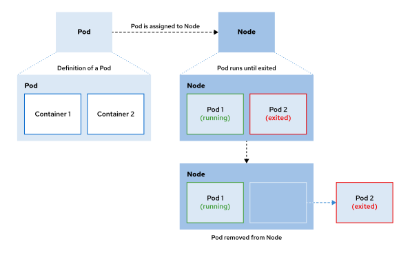

# OPENSHIFT

Red Hat OpenShift Container Platform (RHOCP) 

## OVERVIEW

RHOCP is a set of modular components and services that are built on top of kubernetes container infrastructure.
It adds capabilities to the production platform as remote management, multitenancy, increased security,
monitoring and auditing, application lifecycle management, and self-service interfaces for developers.

## FEATURES

RHOCP adds the following features to a Kubernetes cluster

### Developers workflow

Integrates a built-in container registry, Continuous Integration/Continuous Delivery (CI/CD) pipelines, 
and Source-to-Image (S2I), a tool to build artifacts from source repositories to container images.

### Routes

Exposes services to the outside world easily

### Metric and logging

Includes a built-in and self-analyzing metrics service and aggregated logging.

### Unified UI

Provides unified tools and an integrated UI to manage the different capabilities.

---

## LIFECYCLE

Lifecycle of Applications in Red Hat OpenShift Container Platform.  
The following figure illustrates the basic lifecycle of an application that is deployed in a RHOCP cluster.

1. Starts with the definition of a pod and the containers that it is composed of, which contain the application.
1. Pods are assigned to a healthy node.
1. Pods run until their containers exit.
1. Pods and their containers are removed from the node.  
	Depending on policy and exit code, RHOCP might remove pods after exiting, or might retain them to enable access to the pod container logs.

